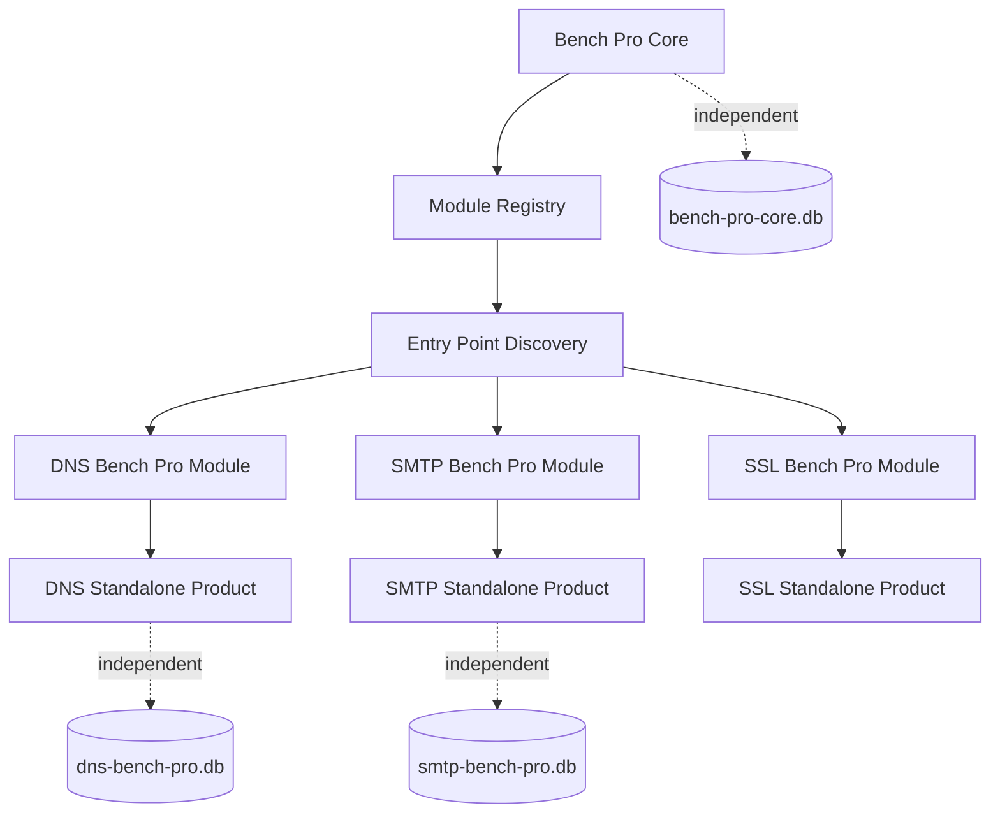
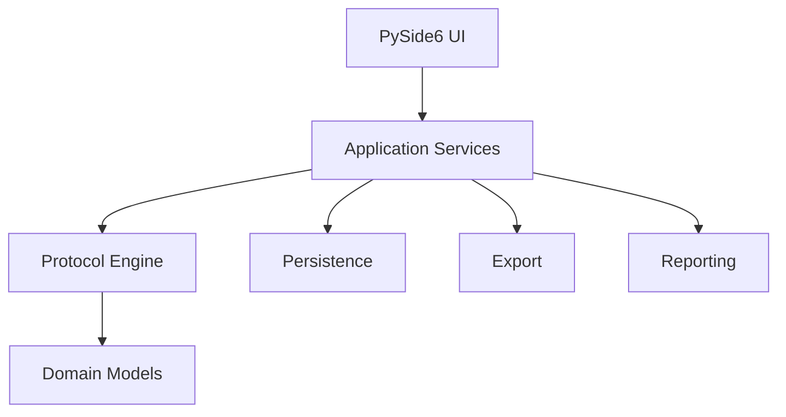
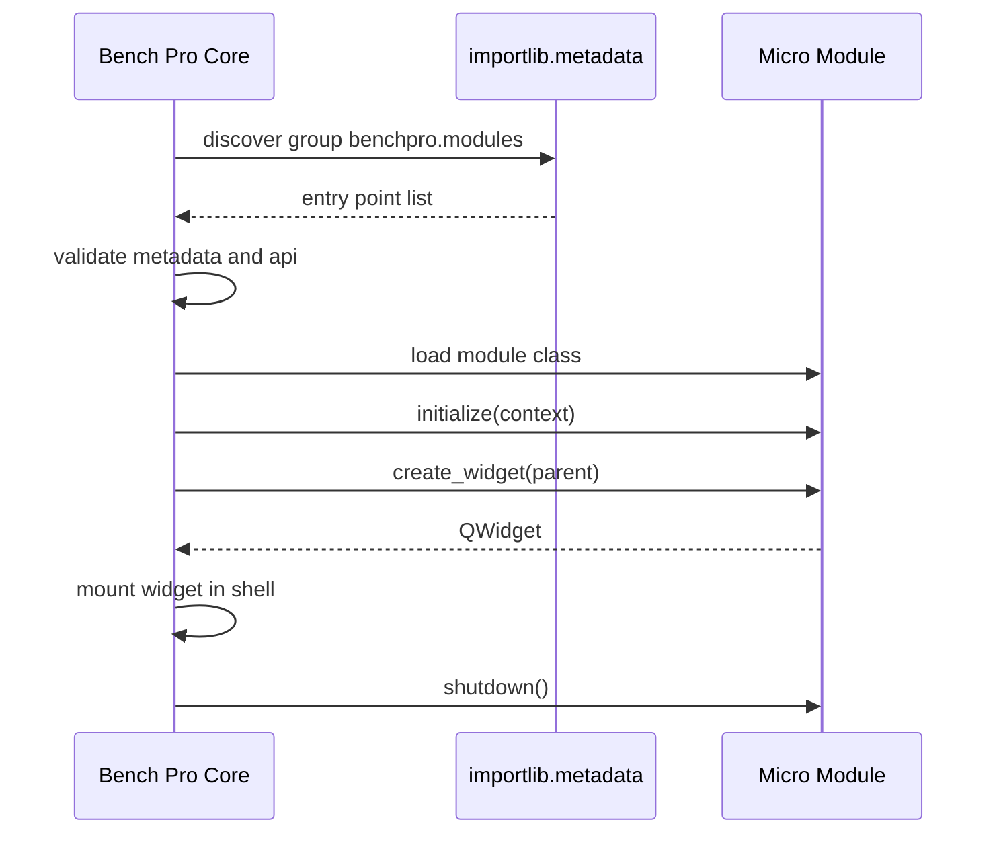

# Bench Pro Architecture

Status: Draft v1.0

Vendor: WL Tech

Copyright: Copyright (c) 2026 WL Tech

## Purpose

Bench Pro is a federated ecosystem of professional desktop diagnostic and benchmark tools.

The ecosystem contains independent micro applications, such as DNS Bench Pro and SMTP Bench Pro, and a separate aggregator product named Bench Pro Core.

The architectural goal is to let every micro application remain a complete standalone product while also exposing an optional integration surface that Bench Pro Core can discover and host.

## Products

Initial products:

- DNS Bench Pro
- SMTP Bench Pro
- SSL Bench Pro
- HTTP Bench Pro
- SSH Bench Pro
- NTP Bench Pro
- Bench Pro Core

Each product owns its repository, version, release process, issue tracker, database, settings, logs, documentation, CI, and executable.

## Core Rule

The dependency direction is absolute:

```text
Bench Pro Core
      |
      v
Micro applications
```

Never:

```text
Micro application
      |
      v
Bench Pro Core
```

Micro applications must not import `bench_pro_core`, depend on Core settings, depend on Core databases, or require Bench Pro Core to be installed.

## Architecture Overview



## Micro Application Shape

Each micro application has two personalities:

- Standalone Application
- Integratable Module

Standalone execution examples:

```text
python -m dns_bench_pro
DNS-Bench-Pro.exe
```

Integrated execution:

```text
Bench Pro Core discovers DNS Bench Pro and embeds its integration widget.
```

The integration capability is optional. A micro application must be useful, testable, and releasable without the Core.

## Internal Layering

Micro applications should keep business logic outside PySide6 widgets.

Recommended flow:



Anti-pattern:

```text
MainWindow resolves protocol traffic, calculates statistics, and writes SQLite directly.
```

Preferred:

```text
MainWindow or ProductWidget calls Application Services.
Application Services orchestrate Engine and Persistence.
```

## Integration Flow



## Data Isolation

Every product owns its data.

Examples:

```text
%APPDATA%\WL Tech\DNS Bench Pro\
%APPDATA%\WL Tech\SMTP Bench Pro\
%APPDATA%\WL Tech\Bench Pro Core\
```

Bench Pro Core must not directly query a micro application's SQLite tables. If integrated history is needed, the module should expose an application-level reader or reporting capability.

## Versioning

Each product uses independent Semantic Versioning.

Integration compatibility is controlled by a separate integer:

```text
Product Version: DNS Bench Pro 1.4.2
Integration API: 1
```

Bench Pro Core validates the Integration API, not the commercial product version.

## Packaging

Each micro application builds its own executable.

Bench Pro Core v1 should prefer a bundled distribution containing supported modules because this reduces installation, support, and PyInstaller complexity.

Future versions may support separately installable modules after the integration model is proven.

## Failure Isolation

A module failure must not close Bench Pro Core.

Core behavior:

- mark module as failed
- preserve the error details
- keep other modules usable
- allow the user to inspect diagnostics
- continue shutdown cleanly

Module boundaries must catch exceptions during discovery, validation, loading, initialization, widget creation, and shutdown.

## Evolution Strategy

Do not create a shared runtime SDK in v1.

Use Python entry points, metadata, and duck typing first. Extract shared packages only after real duplication appears in at least three products or after a documented architectural need becomes unavoidable.

