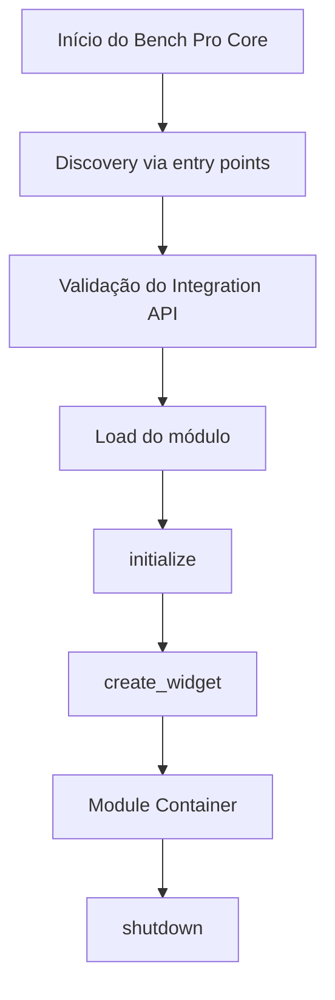

# Arquitetura do Bench Pro Core

## 1. Visão do ecossistema

O ecossistema **Bench Pro** é composto por produtos desktop independentes, desenvolvidos pela **WL Tech**, voltados a diagnóstico, benchmark e auditoria de infraestrutura.

Produtos atuais e planejados:

- DNS Bench Pro
- SMTP Bench Pro
- SSL Bench Pro
- HTTP Bench Pro
- SSH Bench Pro
- NTP Bench Pro
- Bench Pro Core

O **Bench Pro Core** é a aplicação agregadora. Ele hospeda módulos compatíveis dentro de uma interface única, mas não é uma dependência obrigatória das aplicações micro.

## 2. Princípio fundamental

Cada micro aplicação é um produto completo.

Cada micro deve possuir:

- repositório próprio;
- versão própria;
- banco SQLite próprio;
- configuração própria;
- documentação própria;
- CI própria;
- build próprio;
- release própria;
- executável próprio.

O Core agrega módulos. As micros não pertencem ao Core.

## 3. Direção de dependência

Permitido:

```text
Bench Pro Core
      ↓
Módulo DNS / SMTP / SSL / HTTP
```

Proibido:

```text
DNS Bench Pro / SMTP Bench Pro
      ↓
Bench Pro Core
```

Nenhuma micro aplicação deve importar `benchpro_core.*`.

## 4. Fluxo de integração



O Core não instancia classes internas de DNS, SMTP ou qualquer outro produto. Ele fala apenas com o contrato mínimo de integração.

## 5. Contrato de integração

O Integration API v1 exige apenas:

Metadados:

- `module_id`
- `display_name`
- `version`
- `integration_api`
- `vendor`
- `capabilities`

Métodos:

- `initialize()`
- `create_widget(parent=None)`
- `shutdown()`

O contrato é intencionalmente pequeno para evitar acoplamento prematuro.

## 6. Descoberta de módulos

A descoberta usa o mecanismo padrão do Python:

```toml
[project.entry-points."benchpro.modules"]
dns = "integration.module:DNSBenchModule"
smtp = "smtp_bench_pro.integration.module:SMTPBenchModule"
```

Vantagens:

- testável;
- compatível com pacotes instalados/editable;
- não exige registry externo;
- não obriga a micro a conhecer o Core.

## 7. Dados separados

Cada produto mantém seu próprio banco.

Exemplo:

```text
%APPDATA%\WL Tech\Bench Pro Core\bench-pro-core.db
%APPDATA%\WL Tech\DNS Bench Pro\dns-bench-pro.db
%APPDATA%\WL Tech\SMTP Bench Pro\smtp-bench-pro.db
```

O Core não deve executar consultas SQL diretamente no banco de uma micro. Se precisar ler histórico, relatórios ou resultados, deve usar uma API pública da própria micro.

## 8. Isolamento de falhas

Falha em um módulo não pode derrubar o Core.

O Core deve tratar falhas em:

- discovery;
- import;
- validação de contrato;
- initialize;
- create_widget;
- shutdown.

Quando um módulo falha, os demais continuam disponíveis.

## 9. UI Shell

A interface atual do Core contém:

- janela principal;
- navegação vertical;
- container genérico de módulos;
- estado vazio;
- diálogo Sobre;
- status bar;
- menu mínimo.

O Core não duplica UI de módulos. O widget renderizado vem de `create_widget()`.

## 10. Evolução

A arquitetura foi desenhada para crescer sem se transformar em framework interno prematuro.

Regras de evolução:

- manter Integration API v1 estável;
- adicionar capabilities somente quando houver semântica clara;
- extrair biblioteca compartilhada apenas após duplicação real;
- manter contrato pequeno;
- preservar standalone de cada micro;
- testar sempre standalone e integrado.

## 11. Estratégias futuras

Possíveis evoluções:

- dashboard integrado de infraestrutura;
- relatório consolidado de saúde;
- exportação integrada;
- empacotamento com módulos embarcados;
- instalação modular futura;
- Integration API v2 quando houver necessidade real.

## 12. Critério de qualidade arquitetural

Uma alteração é aceitável somente se:

- não quebra standalone de uma micro;
- não cria dependência da micro para o Core;
- não força banco/configuração compartilhada;
- não acopla o Core a classes internas de produto;
- mantém falhas isoladas;
- possui teste de contrato ou integração correspondente.
