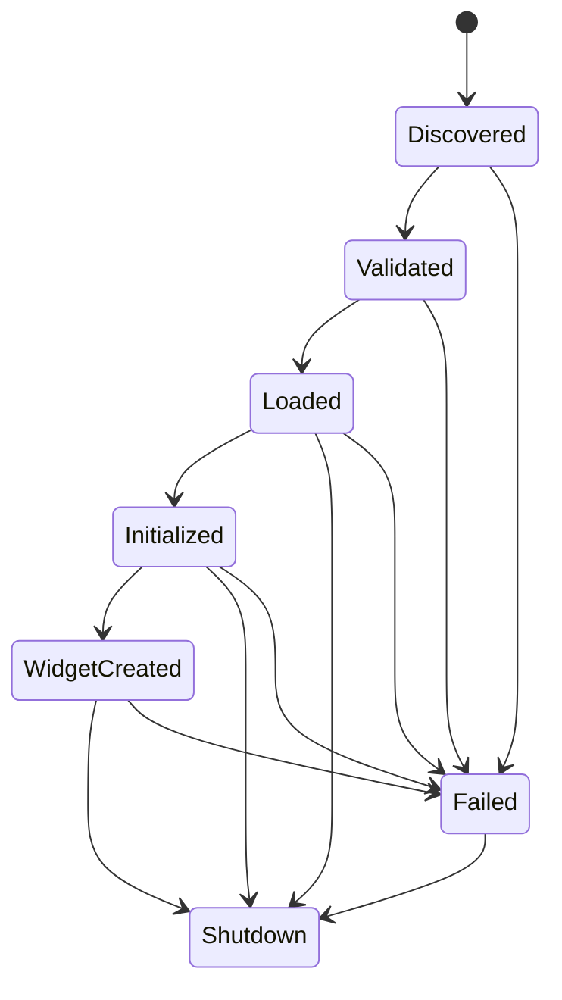

# Bench Pro Module Lifecycle v1

Status: Draft v1.0

## Lifecycle

Integration API v1 uses six lifecycle steps:

```text
discover
validate
load
initialize
create_widget
shutdown
```

No activation or deactivation states are required in v1.

## States



## discover

Core discovers candidates through `importlib.metadata.entry_points` using group `benchpro.modules`.

Expected failures:

- broken package metadata
- duplicate entry point names
- unavailable distribution

Core action:

- record diagnostic
- continue discovering other modules

## validate

Core validates metadata and method presence.

Expected failures:

- missing required field
- unsupported `integration_api`
- invalid `module_id`
- invalid capabilities shape

Core action:

- reject module
- expose validation error
- continue loading other modules

## load

Core imports and instantiates the module class.

Expected failures:

- import error
- missing dependency
- constructor exception

Core action:

- mark module failed
- keep Core running
- keep other modules available

## initialize

Core calls:

```python
module.initialize(context=None)
```

The context is optional in v1 and should be treated as best effort. Modules must not require Core-specific types.

Expected failures:

- module resource initialization error
- missing optional dependency
- internal configuration error

Rollback:

- Core should call `shutdown()` if an instance exists.
- Module `shutdown()` must tolerate partial initialization.

## create_widget

Core calls:

```python
widget = module.create_widget(parent=container)
```

The returned object must be a `QWidget`.

Expected failures:

- UI dependency failure
- invalid widget return type
- module-specific initialization problem

Rollback:

- detach partial UI
- call `shutdown()`
- mark module failed

## shutdown

Core calls shutdown during application close or after failed initialization.

Required behavior:

- stop module-owned workers
- release timers, sockets, and file handles
- flush module-owned state if needed
- avoid raising exceptions

Idempotency:

- `shutdown()` should be safe to call more than once.

## Error Handling Boundary

Core must treat every module call as a fault boundary.

No exception from a module may close Bench Pro Core.

